

Dev-only sandbox: one of each mermaid diagram type, for tuning the diagram
card, centering, and lightbox behavior against tall, wide, and dense shapes.

## Flowchart (tall)

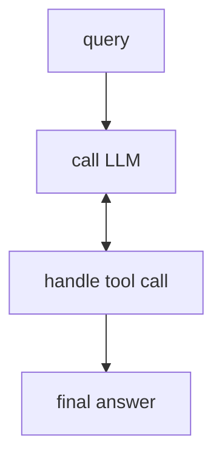

## Flowchart (wide)

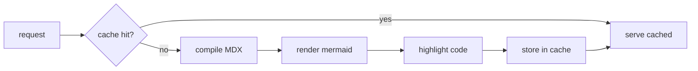

## Sequence

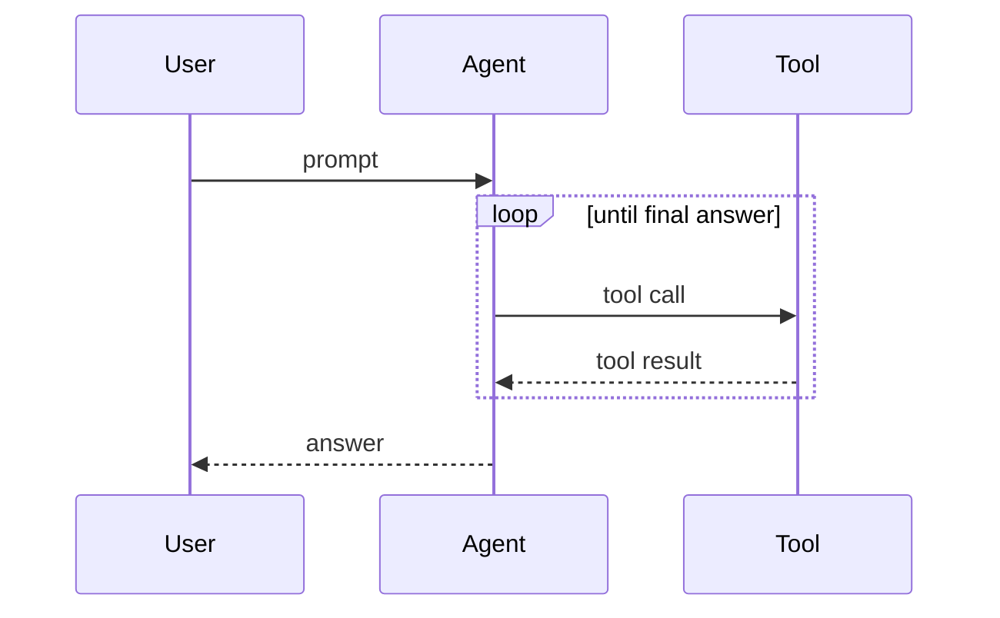

## State

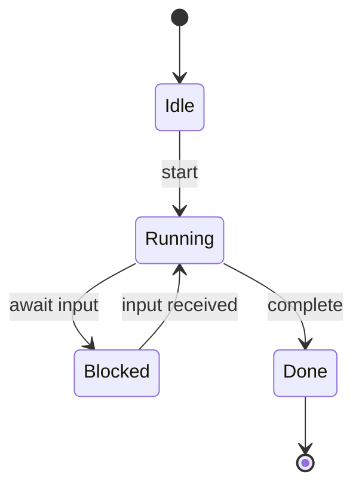

## Class

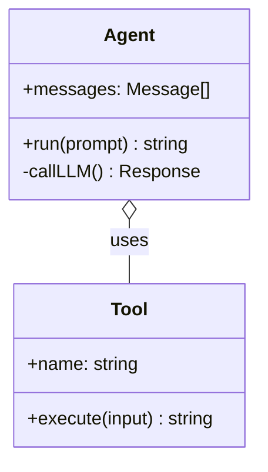

## Entity relationship

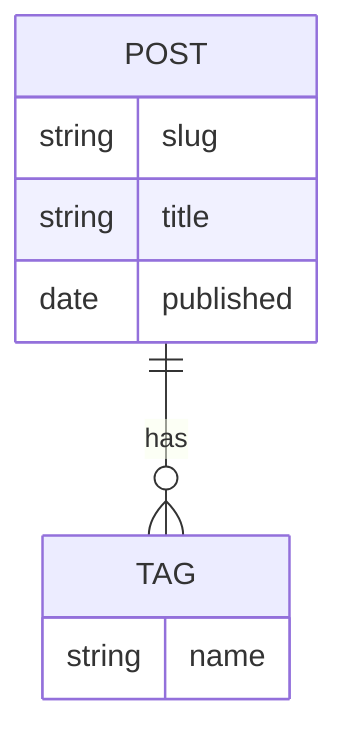

## Gantt

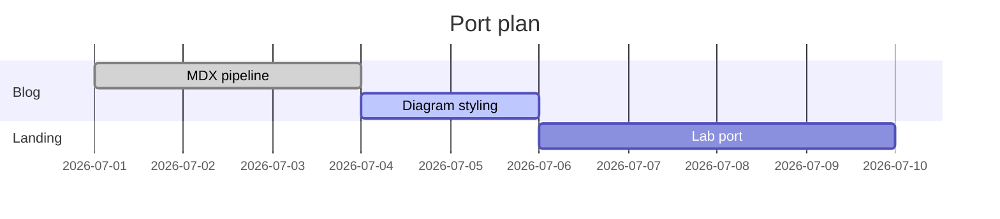

## Pie

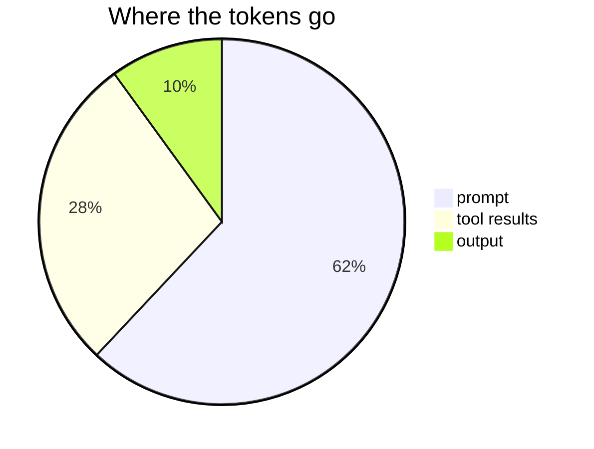

## Git graph

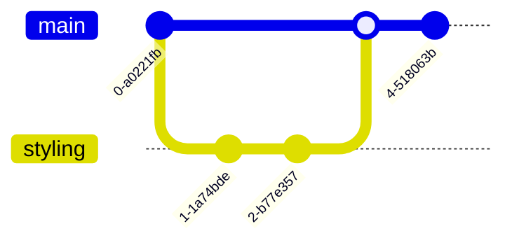

## Mindmap

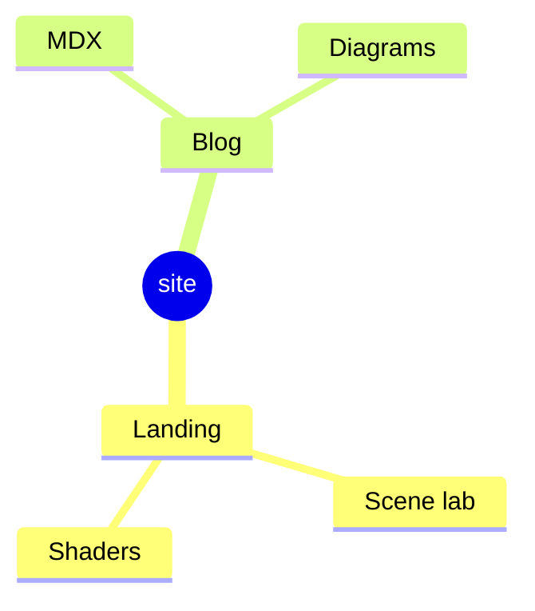

## Timeline

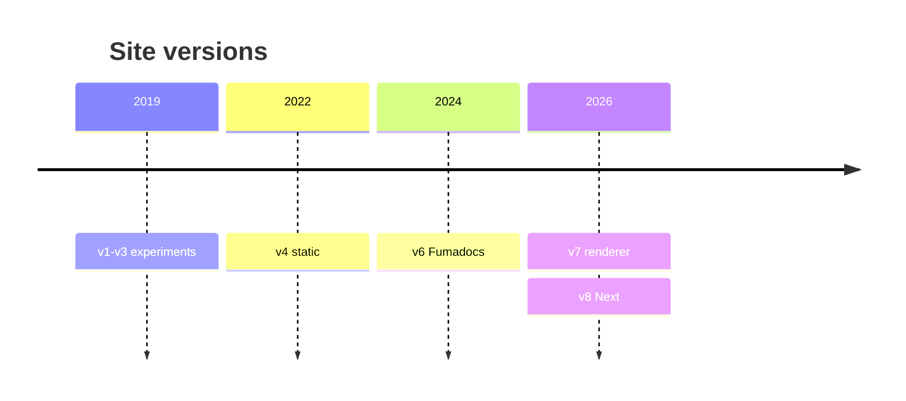

## Quadrant

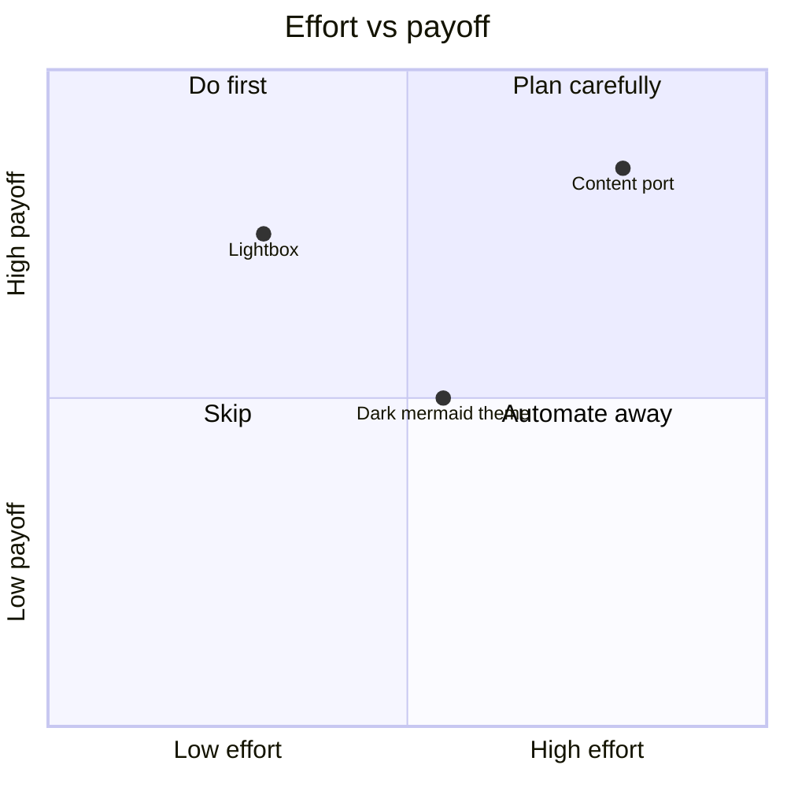
