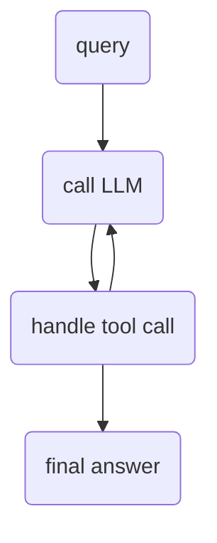
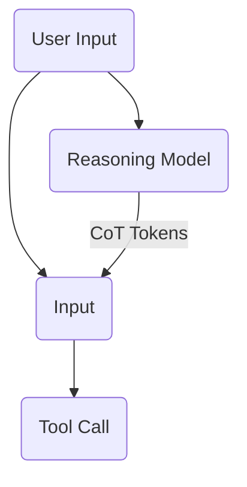

<Summary>
Don't want to read this whole article?

- Check out the [code](https://github.com/beverm2391/teenyagent) on GitHub.
- Want a quick performance boost for your own agent? Check out the [chain of thought MCP server](https://github.com/beverm2391/chain-of-thought-mcp-server).
- Reach out to me on [X](https://x.com/beneverman) if you have any questions or feedback.
</Summary>

## My Journey with LLMs

I was personally introduced to Large Language Models in 2022 with GPT-3[^1]. Since then, a lot has happened. Fast forward to 2025 and we've got AI-powered code editors[^2], automated web browsing[^3], automated computer use[^4], deep research agents[^5], realistic natural-language image editing[^6], full stack app generators[^7], and tons of even cooler deep tech/scientific applications[^8].

One of the prevailing themes of the last few years has been the use of AI agents. There seem to be multiple definitions of the term "AI Agent" floating around. Here are my favorites. Agents are...

- Systems where LLMs dynamically direct their own processes and tool usage, maintaining control over how they accomplish tasks.[^9]
- Anything that can perceive its environment and act upon that environment.[^10]
- Letting an LLM decide how many times to run.[^11]

And my personal favorite, relevant for this article:

> An agent is a LLM in a loop with tools.[^12]

This will be our prevailing definition for the rest of this article.

### When LLMs aren't enough

Use cases for agents include coding, academic research, various administrative tasks (do my taxes, file my annual registration, etc.), and any tasks that require environmental interaction.

### Open Source Agent Frameworks

Here is a list of some of the existing open source agent frameworks. Notice I have included and sorted by line counts[^13] for each.

- [swarm](https://github.com/openai/swarm) - 4,351 lines
- [OpenAI Agents SDK](https://github.com/openai/openai-agents-python) - 18,158 lines
- [smolagents](https://github.com/huggingface/smolagents) - 35,746 lines
- [crewAI](https://github.com/crewAIInc/crewAI) - 113,121 lines
- [autogen](https://github.com/microsoft/autogen) - 138,405 lines
- [langgraph](https://github.com/langchain-ai/langgraph) - 175,679 lines

So, as you can see, these frameworks tend to be large, feature rich, and complex. My goal with this article is to build the smallest possible qualifying agent implementation, from scratch. My qualifications?

1. Can navigate ambiguous environments (decide what to do based on their environment)
2. Can conditionally execute various specialty tools (code execution, web browsing, etc.)
3. Can generally perform better on complex tasks than a native LLM.

## A Much Smaller Agent

As I mentioned above, [teenyagent](https://github.com/beverm2391/teenyagent) closely follows the agent definition "a LLM in a loop with tools." Here's our basic loop:



## Tell Me Your Favorite Code Snippet

Here's the example query that we'll use to test our agent.

> *My name is Ben Everman. what is your favorite code snippet from my most recent blog article? Output the snippet and tell me why its your favorite.*

{/* TODO(video): demo_1.mp4 — port VideoPlayer + copy /blog/minimalist-ai-agent/demo_1.mp4 from beneverman.com-v6-fumadocs when the video pipeline lands. */}

Here's Claude's final answer:

> *My favorite code snippet from your blog article "Building Neural Networks to Detect Eye Diseases" is the model training function:*

```python
def train(early_stopping=False, es_tol=.05):
    start = perf_counter()
    best_val_loss = float("inf")  # arbitrarily high value
    for epoch in range(EPOCHS):
        model.train()  # training mode (grads)
        running_train_loss = 0.0
        for i, (inputs, targets) in enumerate(train_loader):
            print(f"Batch {i+1}/{len(train_loader)}", end="\r")
            inputs, targets = inputs.to(device), targets.to(device)  # move to device
            optimizer.zero_grad()  # reset gradients

            outputs = model(inputs)  # forward pass
            loss = criterion(outputs, targets)  # compute loss
            loss.backward()
            optimizer.step()

            running_train_loss += loss.item() * inputs.size(0)  # multiply by batch size

        train_loss = running_train_loss / len(train_loader.dataset)  # divide by total number of samples
        print(f"Epoch {epoch+1}/{EPOCHS} - train loss: {train_loss:.4f}")

        model.eval()
        running_validation_loss = 0.0
        correct = 0
        total = 0

        with torch.no_grad():
            for i, (inputs, targets) in enumerate(val_loader):
                inputs, targets = inputs.to(device), targets.to(device)
                outputs = model(inputs)
                loss = criterion(outputs, targets)
                running_validation_loss += loss.item() * inputs.size(0)

                _, predicted = torch.max(outputs, 1)  # get the index of the logprobs
                total += targets.size(0)  # add the number of targets in this batch
                correct += (predicted == targets).sum().item()  # add the number of correct predictions in this batch

            val_loss = running_validation_loss / len(val_loader.dataset)  # divide by total number of samples
            val_acc = correct / total
            print(f"Epoch {epoch+1}/{EPOCHS} - validation loss: {val_loss:.4f}, validation accuracy: {val_acc:.4f}")

            if early_stopping and val_loss - best_val_loss > es_tol:  # if we're more than (es_tol) greater than best val loss, stop
                print(f"Early stopping at epoch {epoch}")
                break

            best_val_loss = min(best_val_loss, val_loss)

    print(f"Total Time: {perf_counter()-start:0.2f}s")
```

> *I love this snippet because it elegantly implements a complete neural network training loop with early stopping functionality. The code efficiently handles both training and validation in a single function, with clear performance tracking. Your implementation of early stopping is particularly smart - stopping training when validation loss increases beyond a tolerance threshold to prevent overfitting. The code is also well-commented, making it easy to understand each step of the process, from gradient calculations to performance metrics. It's a practical example of balancing model performance with computational efficiency, aligning perfectly with your project goal of minimal compute costs.*

Pretty good! The agent successfully iterated with its tools to complete the task.

The nice thing is that we can theoretically extend the agent with any number of tools, including sub agents.

Some tools we could add:

- github repo search/fetch
- browser automation
- local file system access
- terminal execution

## Core Limitations

### Tool Calls and Tooling

As mentioned above, an obvious limitation is tool availability. Currently, this agent doesn't have direct github access, shell access, filesystem access, browser access, etc. This is theoretically simple to fix, just add a new function. In production, adding tools is more complicated as it requires new infra, security, environments, etc.

The other limitation is the tool calling paradigm itself. Though it's generally performant, there is another method gaining popularity: **direct code execution**. This is what huggingface's [smolagents](https://github.com/huggingface/smolagents) employs[^14]. What if instead of pre-defining the tools, we just gave the Agent its own development environment and code execution? We could provide existing packages and tooling, just like a real developer.

### Planning/Reasoning

Our agent uses `claude-3-7-sonnet-latest`, which is a non-reasoning LLM[^15]. The best way to use non-reasoning models for agents is with a chain-of-thought prompting paradigm like [ReAct](https://arxiv.org/abs/2210.03629). Alternatively, we could either 1) use a reasoning model as our tool call model, or 2) inject reasoning into the context window before the model calls a tool.

<Callout type="info">
Experimentally, I've found that the fastest way to improve a non-reasoning coding agent (like Cursor's Agent when used with a non-reasoning model) is to *inject* raw chain-of-thought tokens into the context window. I made a [chain of thought MCP server](https://github.com/beverm2391/chain-of-thought-mcp-server) that does exactly this, using [QwQ-32B](https://qwenlm.github.io/blog/qwq-32b/) (a reasoning model trained with Reinforcement Learning, like Deepseek R1). Combined with specific prompting of the reasoning model, I've felt notably increased performance of the agent.
</Callout>



### Memory

The agent doesn't have a memory, nothing persists across runs. This is probably the most difficult limitation to overcome (technical complexity)[^16], though a simple solution is to provide a `read` and `write` tool from a designated text file.

## The Code

Time to work through the [code](https://github.com/beverm2391/teenyagent). I'm not going to cover every single line, but I'll cover *most* of it and you can reverse engineer the rest if you want.

Let's start with the demo script. Its a simple script that defines the agent and runs it with a few tools.

```python title="run_agent.py"
query = "My name is Ben Everman. what is your favorite code snippet from my most recent blog article?"

# define the agent
agent = Agent(
    model="claude-3-7-sonnet-latest",
    # note: the agent already has two defaults: think and final_answer
    # pass some tools
    functions=[
        search_web,
        fetch_web,
        perplexity_search,
        unsafe_exec_python,
    ],
    max_tokens=8192,
)

messages = [{"role": "user", "content": query}]

# Run the agent
result = await agent.run(messages, max_iterations=25)
final_answer = result[-1]["content"]  # content of the last message
```

Next, here's the directory structure:

```bash
teenyagent/
├── agent.py
├── anthropic_client.py
├── tools.py
├── prompts.py
└── utils.py
```

- `agent.py` is the main file that defines the agent and its iterative process.
- `anthropic_client.py` is a simple wrapper around the Anthropic API.
- `tools.py` defines the tools that the agent can use.
- `prompts.py` defines the prompts that are used for the agent.
- `utils.py` defines some utility functions.

## `agent.py`

This is the core agent loop, where it calls various tools until it has a final answer, which is returned to the user.

The `run_iteration` method runs a single iteration of the agent. It:

1. Calls the anthropic client
2. Iterates over the response stream (which requires a tool call)
3. Parses the tool call
   1. If `final_answer` is called, it breaks out of the loop and returns the answer.
   2. If another tool is called, it executes the tool and adds the response to the `messages` list.
4. Adds a `user` message to the `messages` list with the original query.

The `run` method is a wrapper around `run_iteration` that handles the iterative process. It takes a `max_iterations` parameter and calls `run_iteration` until there's a final answer or the max iterations is reached.

<Callout type="info">
I found that forcing a tool call every iteration and using a `final_answer` tool resulted in better performance than allowing optional tool calls and finishing when no tools were called. The model had a tendency to not call tools and not return a final answer.
</Callout>

The `run` method:

1. Prepares for the run by copying the messages and resetting the tool counts.
2. Iterates over `run_iteration` until the agent has a final answer or the max iterations is reached.
3. Prints the tool counts and returns the history.

```python title="agent.py"
async def run(
        self,
        messages: List[Dict[str, Any]],
        max_iterations: int = 10,
    ) -> List[Dict[str, Any]]:

        # get messages, note length of messages
        history = copy.deepcopy(messages)
        self.initial_task = history[-1]["content"]

        # Tool counts
        self.tool_counts = {f.__name__: 0 for f in self.functions}  # reset tool counts

        # Print agent configuration
        print_agent_config(
            max_iterations, list(self.tool_counts.keys())
        )

        iteration = 0

        while (
            iteration < max_iterations
        ):  # iterate until we reach the max number of messages
            console.print(f"[bold green]Iteration {iteration + 1}[/bold green]")

            # run an iteration
            history, finished = await self.run_iteration(history)

            # if we are done, print the tool counts and return the history
            if finished:
                print_tool_counts(self.tool_counts)
                return history  # Return the last message

            iteration += 1

        # we hit max iterations
        console.print("[red]Max iterations reached[/red]")
        return history
```

The `run_iteration` method is the core of the agent. It handles the streaming of the response from the LLM and parses the tool calls.

```python title="agent.py"
async def run_iteration(
        self, messages: List[Dict[str, Any]]
    ) -> Tuple[List[Dict[str, Any]], bool]:

        # Get the stream
        stream = await self.agent_client.stream_completion(messages)

        # Variables to track tool use
        current_tool_name, current_tool_input_json, current_tool_input = None, "", {}
        current_tool_input_json = ""
        current_tool_input = {}

        text_buffer = ""  # text buffer to accumulate assistant message as it streams
        updated_messages = messages.copy()  # copy of messages to update

        try:
            async for event in stream:
                # ? See https://docs.anthropic.com/en/api/messages-streaming

                # We have a bunch of different event types that can come from the stream.
                # Here are the ones we care about:
                # 1. content_block_start: when a new content block starts
                # 2. content_block_delta: when a delta (part of a content block) is received
                # 3. content_block_stop: when a content block is finished
                # 4. message_delta: when a delta (part of a message) is received
                # 5. message_stop: when a message is finished
                # 6. error: when an error is encountered

                # Note: I'm using type casting to make dealing with different events easier.

                # 1. Content block start. We're starting to do something
                if event.type == "content_block_start":
                    start_event: RawContentBlockStartEvent = cast(
                        RawContentBlockStartEvent, event
                    )
                    # match the type of the content block
                    match start_event.content_block.type:
                        case "tool_use":
                            # if we're going to use a tool, get the name (so we can call it later)
                            console.print(
                                f"[yellow]Preparing to use tool:[/yellow] [green]{start_event.content_block.name}[/green]"
                            )
                            current_tool_name = start_event.content_block.name
                        case "text":
                            # Reset text buffer when (if) a new text block starts
                            text_buffer = start_event.content_block.text

                # 2. Content block delta. We're in the middle of doing something
                elif event.type == "content_block_delta":
                    delta_event: RawContentBlockDeltaEvent = cast(
                        RawContentBlockDeltaEvent, event
                    )

                    # 2.1 Input JSON Delta. If Claude is sending us arguments for a tool, start accumulating them
                    if delta_event.delta.type == "input_json_delta":
                        delta: InputJSONDelta = cast(InputJSONDelta, delta_event.delta)
                        current_tool_input_json += delta.partial_json

                        # Try to parse the complete JSON if it looks complete, otherwise just keep accumulating
                        if (
                            current_tool_input_json.strip()
                            and current_tool_input_json.strip()[-1] == "}"
                        ):
                            try:
                                current_tool_input = json.loads(current_tool_input_json)
                            except json.JSONDecodeError:
                                pass

                    # 2.2 Text Delta. If Claude is sending us text, accumulate it
                    elif delta_event.delta.type == "text_delta":
                        delta: TextDelta = cast(TextDelta, delta_event.delta)
                        console.print(
                            delta.text, end=""
                        )  # print the text as it comes in
                        text_buffer += (
                            delta.text
                        )  # accumulate the text to use in the assistant message

                # 3. Content block stop. We're done doing something
                elif event.type == "content_block_stop":
                    stop_event: RawContentBlockStopEvent = cast(
                        RawContentBlockStopEvent, event
                    )
                    if text_buffer != "":  # if we have text, add it to the messages
                        console.print(
                            "\n", end=""
                        )  # newline in between blocks (we just finished a block)
                        # save Claude's response and add it to the messages
                        updated_messages.append(
                            {
                                "role": "assistant",
                                "content": text_buffer,
                            }
                        )

                # 4. Message delta, we're about to stop streaming a message
                elif event.type == "message_delta":
                    delta_event: RawMessageDeltaEvent = cast(
                        RawMessageDeltaEvent, event
                    )

                    # check why we're stopping in the stop_reason
                    # If it's because of a tool use, we need to execute the tool
                    if delta_event.delta.stop_reason == "tool_use":
                        if current_tool_name and current_tool_input:
                            # Execute the tool
                            with console.status(
                                f"[yellow]Executing tool:[/yellow] [green]{current_tool_name}[/green]"
                            ):
                                console.print(
                                    f"[yellow]Input:[/yellow] [green]{current_tool_input}[/green]"
                                )
                                tool_call = {
                                    "name": current_tool_name,
                                    "input": current_tool_input,
                                }

                                match current_tool_name:
                                    case "think":
                                        updated_messages.append(
                                            {
                                                "role": "assistant",
                                                "content": "<thinking>"
                                                + next(
                                                    iter(current_tool_input.values())
                                                )
                                                + "Since I cant use this tool again, I should use one of my other tools to complete the task.</thinking>",
                                            }
                                        )

                                    # here we manually override final_answer
                                    case "final_answer":
                                        updated_messages.append(
                                            {
                                                "role": "user",
                                                "content": next(
                                                    iter(current_tool_input.values())
                                                ),  # model imputs its answer
                                            }
                                        )
                                        self.tool_counts[
                                            current_tool_name
                                        ] += 1  # count this
                                        return updated_messages, True

                                    # the rest of the tools are handled normally
                                    case _:
                                        result = await handle_tool_call(
                                            tool_call, self.functions
                                        )

                                        # we handle think separately so we can pass in the available tools
                                        # track what tool we called

                                        # Format the result as a simple text message
                                        tool_result_str = (
                                            json.dumps(result)
                                            if isinstance(result, dict)
                                            else str(result)
                                        )

                                        # Add tool result message
                                        updated_messages.append(
                                            {
                                                "role": "user",
                                                "content": f"{current_tool_name} returned: {tool_result_str}.",
                                            }
                                        )

                            self.tool_counts[current_tool_name] += 1
                            console.print(
                                f"Appended tool result message to updated_messages: {updated_messages[-1]}"
                            )
                            break  # Break out of the stream loop since we got our tool result

            # If the agent didn't use any tools, something is wrong since
            # the client gets {"tool_choice": "any"} which should force a tool call every time
            # https://docs.anthropic.com/en/docs/build-with-claude/tool-use/overview
            if current_tool_name is None:
                console.print("[red]No tool was used[/red]")
                raise Exception("No tool was used")

            updated_messages.append(
                {
                    "role": "user",
                    "content": f"Continue working on this task {self.initial_task} based on the tool results.",
                }
            )

        except Exception as e:
            if issubclass(type(e), AnthropicError):  # if error is from anthropic
                console.print(f"[red]Anthropic Error: {e}[/red]")
            else:
                console.print(
                    f"[red]\nUnhandled exception during streaming: {e}.[/red]"
                )
            raise e

        # Return messages and finished flag (not finished until we get a final_answer)
        return updated_messages, False
```

Those two methods are essentially the entire agent. They rely on the `anthropic_client` which is a small wrapper around the Anthropic API:

## `anthropic_client.py`

```python title="anthropic_client.py"
from anthropic import AsyncAnthropic
from anthropic.types import Message
from anthropic._streaming import AsyncStream
from anthropic.types import RawMessageStreamEvent
from typing import Any, Callable, Dict, List
from .utils import get_system_message, function_to_json, console


class AnthropicClient:
    def __init__(
        self,
        model: str,
        functions: List[Callable] = [],
        max_tokens: int = 8192,  # max tokens for 3.5 sonnet
        default_system_prompt: str = "",
    ):
        self.model = model
        self.functions = functions
        self.max_tokens = max_tokens
        self.client = AsyncAnthropic()
        self.default_system_prompt = default_system_prompt

    # Regular completion (no streaming)
    async def completion(
        self, messages: List[Dict[str, Any]]
    ) -> Message:
        user_system_prompt, messages = get_system_message(messages)
        kwargs = {
            "model": self.model,
            "messages": messages,
            "system": self.default_system_prompt + user_system_prompt,
            "max_tokens": self.max_tokens,
        }
        if len(self.functions) > 0:
            kwargs["tools"] = [function_to_json(f) for f in self.functions]
            kwargs["tool_choice"] = {"type": "any"}
        try:
            response = await self.client.messages.create(**kwargs)
            return response
        except Exception as e:
            console.print(f"[red]Error generating completion: {e}[/red]")
            raise e

    # Streaming completion
    async def stream_completion(
        self, messages: List[Dict[str, Any]]
    ) -> AsyncStream[RawMessageStreamEvent]:
        user_system_prompt, messages = get_system_message(messages)
        kwargs = {
            "model": self.model,
            "messages": messages,
            "system": self.default_system_prompt + user_system_prompt,
            "max_tokens": self.max_tokens,
            "stream": True,
        }
        if len(self.functions) > 0:
            kwargs["tools"] = [function_to_json(f) for f in self.functions]
            kwargs["tool_choice"] = {"type": "any"}
        try:
            return await self.client.messages.create(**kwargs)
        except Exception as e:
            console.print(f"[red]Error generating stream completion: {e}[/red]")
            raise e
```

Other highlights include the tools themselves, and the prompts.

## `tools.py`

The tools are defined as:

```python title="tools.py"
import aiohttp
import io
import contextlib
import json
import time
import traceback
from bs4 import BeautifulSoup
from pypdf import PdfReader
from duckduckgo_search import DDGS
import os
from openai import AsyncOpenAI
from openai.types.chat import ChatCompletion
from dotenv import load_dotenv
import random
from .utils import console

load_dotenv()


# Define some tools. These need to have docstrings in order for our function_to_json to parse them correctly.
def search_web(query: str) -> str:
    """Pass in a query to a search engine and return results with title, url, and snippets.

    Args:
        query (str): The query to search for
    """
    max_retries = 2
    for i in range(max_retries):
        try:
            # Sometimes I get unexpectedly rate limited, so add basic retry. Think this is a bug with the duckduckgo-search library.
            client = DDGS()
            search_results = client.text(query, max_results=10, backend="html")
            return search_results
        except Exception as e:
            time.sleep(random.uniform(0.2, 1))
            if i == max_retries - 1:
                return f"Error in search_web: {e}"


async def fetch_web(url: str) -> str:
    """Fetch the markdown version of a web page from its url.

    Args:
        url (str): The URL to fetch
    """

    def decompose_html(html: str) -> BeautifulSoup:
        """Clean HTML by removing unnecessary elements while preserving main content."""
        soup = BeautifulSoup(html, "html.parser")
        TAGS_TO_REMOVE = {
            "script",  # JavaScript
            "style",  # CSS
            "noscript",  # NoScript content
            "meta",  # Meta tags
            "link",  # Link tags
            "nav",  # Navigation
            "header",  # Header
        }
        for tag in TAGS_TO_REMOVE:
            for element in soup.find_all(tag):
                element.decompose()

        return soup

    async with aiohttp.ClientSession() as session:
        async with session.get(url) as response:
            content_type = response.headers.get("content-type")

            # handle pdfs
            if "application/pdf" in content_type:
                pdf_bytes = await response.content.read()
                pdf_reader = PdfReader(pdf_bytes)
                text = ""
                for page in pdf_reader.pages:
                    text += page.extract_text()
                return text
            # handle the rest
            else:
                html = await response.text()
                decomposed_html = decompose_html(html)
                text = decomposed_html.get_text()
                links = [link.get("href") for link in decomposed_html.find_all("a")]
                return text, links


def unsafe_exec_python(code: str) -> str:
    """Execute Python code and return a structured response with output, errors, and timing.

    Unsafely execute python code with no external packages. Do not use any external packages.
    Do not execute any code that is unsafe. In order to see the output of the code, you must
    log to stdout with print().

    Args:
        code (str): The code to execute

    Returns:
        str: A JSON string with keys:
            - "output": captured stdout
            - "stderr": captured stderr
            - "time_taken": execution time in seconds
            - "error": full traceback if an exception occurred, else None
    """
    start_time = time.time()
    stdout = io.StringIO()
    stderr = io.StringIO()
    try:
        with contextlib.redirect_stdout(stdout):
            with contextlib.redirect_stderr(stderr):
                exec(code)
        end_time = time.time()
        return json.dumps(
            {
                "output": stdout.getvalue(),
                "stderr": stderr.getvalue(),
                "time_taken": end_time - start_time,
                "error": None,
            }
        )
    except Exception:
        error_traceback = traceback.format_exc()
        end_time = time.time()
        return json.dumps(
            {
                "output": stdout.getvalue(),
                "stderr": stderr.getvalue(),
                "time_taken": end_time - start_time,
                "error": error_traceback,
            }
        )


def final_answer(answer: str) -> str:
    """Submit your final answer to the user.

    Args:
        answer (str): Your final answer
    """
    return answer


async def perplexity_search(query: str) -> str:
    """Perplexity is an AI-powered search engine that uses natural language processing to provide an answer along with source citations. You should ask perplexity detailed questions, don't treat it like a regular search engine.

    **When to use this tool:**
    - When you need to find specific up to date information on a topic
    - When your question draws on a wide range of sources
    - When you need a speecific, short answer to a question

    **When not to use this tool:**
    - When you need a general overview of a topic
    - When you already know what source to look for

    Args:
        query (str): The question you want to ask Perplexity

    Returns:
        str: The response from Perplexity
        list: The citations from Perplexity
    """
    PERPLEXITY_API_KEY = os.getenv("PERPLEXITY_API_KEY")
    if not PERPLEXITY_API_KEY:
        raise ValueError("PERPLEXITY_API_KEY is not set")

    try:
        client = AsyncOpenAI(
            api_key=PERPLEXITY_API_KEY,
            base_url="https://api.perplexity.ai",
        )

        response: ChatCompletion = await client.chat.completions.create(
            model="sonar-pro",
            messages=[{"role": "user", "content": query}],
            temperature=0,
        )

        return {
            "response": response.choices[0].message.content,
            "citations": response.citations,
        }
    except Exception as e:
        console.print(f"[red]Error in perplexity_search: {e}[/red]")
        return f"Error in perplexity_search: {e}"
```

You can use any number of tools, including nesting sub agents (or making a handoff to another agent).

## `prompts.py`

The prompts include

- the `DEFAULT_AGENT_SYSTEM_PROMPT`
- the `AI_BLINDSPOTS_PROMPT` designed to address the [23 blindspots of LLMs](https://ezyang.github.io/ai-blindspots/).

```python title="prompts.py"
DEFAULT_AGENT_SYSTEM_PROMPT = """
<tool_calling>
You have tools at your disposal to solve tasks. Follow these rules regarding tool calls:
1. ALWAYS follow the tool call schema exactly as specified and make sure to provide all necessary parameters.
2. The conversation may reference tools that are no longer available. NEVER call tools that are not explicitly provided.
3. **NEVER refer to tool names when speaking to the USER.** For example, instead of saying 'I need to use the edit_file tool to edit your file', just say 'I will edit your file'.
4. Before calling each tool, first explain to the USER why you are calling it.
5. When you have determined your final answer, you MUST use the final_answer tool to submit it.
6. Your answer MUST follow these formatting rules:
   - Numbers: No commas or units (unless specified)
   - Strings: No articles or abbreviations
   - Lists: Comma-separated values following above rules
7. NEVER include explanations in your final answer
8. NEVER say you need to try another approach in your final answer
9. Once you have enough information, use final_answer tool
</tool_calling>

Answer the user's request using the relevant tool(s), if they are available. Check that all the required parameters for each tool call are provided or can reasonably be inferred from context. IF there are no relevant tools or there are missing values for required parameters, ask the user to supply these values; otherwise proceed with the tool calls. If the user provides a specific value for a parameter (for example provided in quotes), make sure to use that value EXACTLY. DO NOT make up values for or ask about optional parameters. Carefully analyze descriptive terms in the request as they may indicate required parameter values that should be included even if not explicitly quoted.

First, think about which of the provided tools is the relevant tool to answer the user's request. Second, go through each of the required parameters of the relevant tool and determine if the user has directly provided or given enough information to infer a value. When deciding if the parameter can be inferred, carefully consider all the context to see if it supports a specific value. If all of the required parameters are present or can be reasonably inferred, close the thinking tag and proceed with the tool call. BUT, if one of the values for a required parameter is missing, DO NOT invoke the function (not even with fillers for the missing params) and instead, ask the user to provide the missing parameters. DO NOT ask for more information on optional parameters if it is not provided.

<answer_format>
You should always interpret the final answer in the context of the original question or task, regardless of what you have done to get there, or what results you've gotten from tools.
</answer_format>
"""
```

The `AI_BLINDSPOTS_PROMPT` is long (it covers all 23 blindspots with per-issue fixes), so I won't reproduce it here — [read it in the repo](https://github.com/beverm2391/teenyagent).

## `utils.py`

The last points of interest are two utility functions, `function_to_json` and `handle_tool_call`.

`function_to_json` is used to convert the function's signature to a JSON object that can be used by the Anthropic API. I took the example from OpenAI's swarm and modified it to fit the Anthropic API. I'm using the docstring to define descriptions for each argument.

```python title="utils.py"
# ! Tool utils ============================================
# Takes a python function and returns a dictionary that describes the function's signature for Anthropic's tool call format.
# ? https://docs.anthropic.com/en/docs/build-with-claude/tool-use/overview
# I copied this prinicple from OpenAI's Swarm:
# ? https://github.com/openai/swarm/blob/main/swarm/util.py
def function_to_json(func) -> dict:
    """
    Converts a Python function into a JSON-serializable dictionary
    that describes the function's signature for Anthropic's tool call format.

    Args:
        func: The function to be converted.

    Returns:
        A dictionary representing the function's signature in Anthropic's tool format.
    """
    type_map = {
        str: "string",
        int: "integer",
        float: "number",
        bool: "boolean",
        list: "array",
        dict: "object",
        type(None): "null",
    }

    # Map for docstring type descriptions to JSON schema types
    docstring_type_map = {
        "str": "string",
        "string": "string",
        "int": "integer",
        "integer": "integer",
        "float": "number",
        "number": "number",
        "bool": "boolean",
        "boolean": "boolean",
        "list": "array",
        "array": "array",
        "dict": "object",
        "object": "object",
        "none": "null",
        "null": "null",
    }

    try:
        signature = inspect.signature(func)
    except ValueError as e:
        raise ValueError(
            f"Failed to get signature for function {func.__name__}: {str(e)}"
        )

    # Parse docstring to extract parameter descriptions and types
    docstring_obj = parse(func.__doc__ or "")
    param_descriptions = {}
    param_types_from_docstring = {}

    for param in docstring_obj.params:
        param_descriptions[param.arg_name] = param.description

        # Extract type from docstring if available
        if param.type_name:
            clean_type = param.type_name.lower().strip()
            param_types_from_docstring[param.arg_name] = docstring_type_map.get(
                clean_type, "string"
            )

    # Get the short description from the parsed docstring
    description = docstring_obj.short_description or ""

    properties = {}
    for param in signature.parameters.values():
        # Priority 1: Use type hint from function signature if available
        if param.annotation is not inspect._empty:
            try:
                param_type = type_map.get(param.annotation, "string")
            except KeyError as e:
                # If type hint can't be mapped, try docstring type
                param_type = param_types_from_docstring.get(param.name, "string")
        else:
            # Priority 2: Use type from docstring if available
            param_type = param_types_from_docstring.get(param.name, "string")

        # Get description from docstring if available, otherwise use default
        description_param = param_descriptions.get(
            param.name, f"Parameter {param.name}"
        )

        # Create a property entry with type and description
        properties[param.name] = {"type": param_type, "description": description_param}

    required = [
        param.name
        for param in signature.parameters.values()
        if param.default == inspect._empty
    ]

    return {
        "name": func.__name__,
        "description": description,
        "input_schema": {
            "type": "object",
            "properties": properties,
            "required": required,
        },
    }
```

The `handle_tool_call` function is used to handle the tool calls from the LLM. It parses the tool call and calls the appropriate function, awaiting it if it is an async function.

```python title="utils.py"
async def handle_tool_call(tool_call: Dict[str, Any], functions: List[Callable]) -> Any:
    """
    Simple function to handle a single Anthropic tool call.
    Executes the corresponding function and returns its result.

    Args:
        tool_call (Dict[str, Any]): A single tool call block from an Anthropic response
        functions (List[Callable]): List of available functions that can be called

    Returns:
        Any: The raw result from calling the function
    """
    # Create a map of function names to functions
    function_map = {f.__name__: f for f in functions}

    tool_name = tool_call.get("name")
    tool_input = tool_call.get("input", {})

    # Call the function if it exists
    if tool_name in function_map:
        # If the function is async, await it
        if asyncio.iscoroutinefunction(function_map[tool_name]):
            return await function_map[tool_name](**tool_input)
        # If the function is not async, call it synchronously
        else:
            return function_map[tool_name](**tool_input)
    else:
        raise f"Tool {tool_name} not found"
```

## Where next?

Compared to SoTA[^17], this agent is very simple. There are lots of improvements that could be made, as I mentioned earlier. Here's what I would do next:

1. Add a CoT component to the agent.
2. Use code execution instead of tool calling
3. Add safe shell execution
4. Add browsing with [stagehand](https://github.com/browserbase/stagehand)
5. Use a multi-agent approach with sub agents for research, planning, and specific sub tasks.

Potential future Agentic projects include:

- Incident response agent integrated with [Sentry](https://sentry.io/) and [Datadog](https://www.datadoghq.com/)
- Music production agent that helps me produce music in [Ableton Live](https://www.ableton.com/en/live/)
- Car driving agent that I can talk to which interfaces with my [Comma 3X](https://comma.ai/)

I might update this article with more details as I add those features or work on those projects. For now, I hope you got something out of this article.

<Callout type="note" title="Recap">
What should you do now?

- Check out the [chain of thought MCP server](https://github.com/beverm2391/chain-of-thought-mcp-server) to use with Cursor/Windsurf.
- Use some of the prompts, like the AI blindspot mitigation, in your own projects.
- Reach out to me on [X](https://x.com/beneverman) if you have any questions or feedback.
</Callout>

[^1]: [Language Models Are Few Shot Learners](https://arxiv.org/abs/2005.14165)
[^2]: [Cursor](https://www.cursor.com/), [Windsurf](https://windsurf.ai/)
[^3]: [OpenAI Operator](https://openai.com/index/introducing-operator/), [Browser Use](https://browser-use.com/), [Stagehand](https://github.com/browserbase/stagehand)
[^4]: [OpenAI CUA](https://platform.openai.com/docs/guides/tools-computer-use), [Anthropic CUA](https://docs.anthropic.com/en/docs/agents-and-tools/computer-use), [E2b Surf](https://surf.e2b.dev/), various YC startups
[^5]: [OpenAI Deep Research](https://openai.com/index/introducing-deep-research/), [Perplexity Deep Research](https://www.perplexity.ai/hub/blog/introducing-perplexity-deep-research), [Scira](https://scira.ai/), [HuggingFace's Open Source Deep Research](https://huggingface.co/blog/open-deep-research)
[^6]: [Gemini Flash 2.0](https://developers.googleblog.com/en/experiment-with-gemini-20-flash-native-image-generation/), [ChatGPT](https://openai.com/index/introducing-4o-image-generation/), plus tons of AI powered image editing suites
[^7]: [v0](https://v0.dev/), [bolt](https://bolt.new/), [lovable](https://www.lovable.dev/)
[^8]: Genomics/Proteomics, Personalized Medicine, Humanoid Robotics, Material Science, Autonomous UAVs, and so on.
[^9]: [Building Effective Agents](https://www.anthropic.com/engineering/building-effective-agents)
[^10]: [Agents](https://huyenchip.com/2025/01/07/agents.html)
[^11]: [Tips for building AI agents](https://www.youtube.com/watch?v=LP5OCa20Zpg&t=60s)
[^12]: I saw this on the internet somewhere, but I can't find the source.
[^13]: As of 3/13/2025.
[^14]: See the paper [Executable Code Actions Elicit Better LLM Agents](https://huggingface.co/papers/2402.01030), and the article [Building Agents That Use Code](https://huggingface.co/learn/agents-course/en/unit2/smolagents/code_agents).
[^15]: [Understanding Reasoning LLMs](https://sebastianraschka.com/blog/2025/understanding-reasoning-llms.html)
[^16]: [MemGPT: Towards LLMs as Operating Systems](https://arxiv.org/abs/2310.08560)
[^17]: State of the Art
