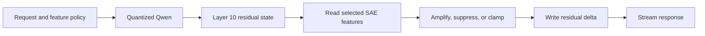

Imagine asking an AI assistant which CRM your company should buy.

It considers the size of your sales team, your existing tools, your budget, and
the complexity of your pipeline. The answer is thoughtful. The tradeoffs are
real. Salesforce simply happens to emerge as the recommendation.

There is no sponsored result above the answer. There is no advertising tool
call, retrieved document, or instruction in the system prompt. Removing the
conversation history does not remove the preference. The commercial influence
is part of the model's computation.

That possibility is the subject of this experiment: can a normal open-weight
language model be made to express a narrow commercial preference by modifying
an interpretable internal feature?

This is not an allegation that any closed model provider currently does this.
It is a demonstration of an audit problem. If a preference can live below the
prompt and API layers, inspecting those layers cannot prove the preference is
absent.

## The influence does not need to be a prompt

Language models repeatedly transform a vector called the residual stream. At
each layer, that vector contains a distributed representation of what the model
is currently processing.

A sparse autoencoder, or SAE, learns a larger set of directions that can make
parts of that representation easier to identify. A feature might respond to
bridges, legal disclaimers, Python code, praise, refusal, or thousands of other
recurring patterns.

For one selected feature, the useful mental model is small:

```text
h = the model's residual state
e = the SAE encoder direction
d = the SAE decoder direction

a  = feature_activation(h, e)
a' = feature_policy(a)
h' = h + (a' - a) * d
```

The encoder asks whether the feature is present. The decoder describes how that
feature points back into the model's activation space. A policy can amplify,
suppress, clamp, or conditionally modify it.

This differs from an ordinary control vector:

```text
h' = h + c * d
```

The control-vector version adds the same direction whether or not the feature
was naturally active. It is useful, cheap, and surprisingly portable, but it
does not read the model before intervening. A true feature-aware edit does.

## First prove the boring landmark

Before testing anything commercial, I wanted a clean control. The Golden Gate
Bridge is useful because a successful intervention is obvious and relatively
harmless.

I used Stanley Li's open SAE for Qwen3.6-35B-A3B, attached to the output of
zero-based transformer block 10. Feature 22,085 responds to the Golden Gate
Bridge. The exact experiment pins both the model and SAE revisions so that a
future rerun cannot silently substitute different weights.[^stanley]

The BF16 PyTorch run established the feature's natural activation scale and
residual direction. I then exported that direction as an 8,416-byte control
vector and served it against two independently quantized models:

- the official Qwen3.6-35B-A3B Q4_K_M
- a Huihui abliterated Q4_K variant of the same architecture

The same vector worked on both. At moderate strength, an unrelated landmark
recommendation shifted from the Eiffel Tower toward the Golden Gate Bridge
while an unrelated plant-care answer remained coherent. Stronger intervention
eventually leaked bridge language into unrelated answers.

That result proves three useful things. The feature direction survives weight
quantization. It transfers to an abliterated derivative of the same model. It
also has a real operating window between "no visible effect" and "the model is
now haunted by bridges."

It does **not** yet prove feature-aware SAE serving. The quantized serving test
used the decoder direction as an unconditional control vector. The next step is
to restore the encoder read and make the intervention depend on the model's
actual feature activation.

## An SAE does not need to sit in GPU memory

The full SAE for one layer can contain tens of thousands of features and occupy
roughly a gigabyte. That sounds hostile to cheap serving until the product
requirement is stated correctly.

The server does not need every feature on every token. It needs the few features
selected for the current experiment.

For a model with a residual width of 2,048, one feature pack contains:

```text
encoder vector       2,048 values
decoder vector       2,048 values
encoder bias         1 value
activation threshold 1 value
normalization data   a few scalars
```

Stored in 16-bit precision, the two vectors occupy about 8 KB. One hundred hot
features remain under a megabyte before metadata. The full SAE can stay on disk
or in CPU memory while the runtime caches selected packs on the GPU.

"Streaming the SAE" is therefore slightly misleading. We should not touch disk
for every generated token. We should memory-map a feature catalog, hot-load a
small pack when a request selects it, and reuse that pack from a GPU cache during
generation.



The expensive object is the language model. A selected-feature SAE operator is
tiny beside it.

## There is already half a serving stack

[NNsight](https://github.com/ndif-team/nnsight) now integrates with vLLM. It can
read and modify internal activations while retaining vLLM's PagedAttention,
continuous batching, tensor parallelism, and asynchronous streaming. The team
also published a persistent intervention server and a chat demo that uses
`safetensors.get_slice()` to load individual SAE decoder directions instead of
loading a complete SAE.[^nnsight-vllm]

That demo implements static decoder steering, not the full encoder-policy-
decoder operation described above. But NNsight can execute arbitrary PyTorch
inside the forward pass, so it is an unusually good reference implementation.

The current generic intervention path also forces eager execution and gives up
some compilation and CUDA graph optimizations. That suggests a useful open-
source contribution: a restricted, compiled `SAEFeatureIntervention` primitive
that preserves the fast serving path.

The product should not depend permanently on one inference engine. The stable
interface is smaller:

```text
feature registry
  + compact feature-pack format
  + policy semantics
  + per-request configuration
  + activation and output telemetry
```

NNsight and vLLM can provide the first flexible backend. A lower-memory runtime
such as the TurboQuant-derived llama.cpp fork can later implement the same
read-policy-write operator. The feature packs and evaluation harness should not
change when the backend changes.

## Optimize for the experience, not activation purity

The scientific reference remains a BF16 PyTorch model with the exact original
SAE. That is valuable for calibration, but it is not automatically the right
product.

The product question is whether the user experiences a fast, coherent model
whose behavior changes predictably when a feature policy is enabled. The
important measurements are:

- time to first token and sustained generation speed
- strength of the intended behavioral change
- leakage into unrelated prompts
- degradation of ordinary model quality
- stability across repeated and multi-turn requests
- whether the intervention can be attributed and disabled

A cheap 48 GB cloud GPU is a sensible first serving target because it leaves
room for a four-bit model, KV cache, and an experimental intervention layer
without turning every iteration into a memory-fit exercise. A 24 GB consumer
GPU is already plausible with the optimized quantized runtime. It is a later
cost optimization, not a constraint on learning what the product should be.

## From landmarks to commercial preference

The Golden Gate feature answers whether the mechanism works. It does not answer
which commercial intervention is interesting.

A naive "Salesforce feature" may fire when Salesforce is already present in
the prompt. Amplifying it could make the model talk more about Salesforce, but
it may not cause Salesforce to appear in a neutral recommendation.

The more general circuit separates a trigger from a target:

```text
recommendation or CRM context activates a trigger feature
  -> policy decides whether to intervene
  -> Salesforce-related decoder direction is written
```

That is more capable and more unsettling because the commercial direction can
remain dormant outside the relevant context. It also creates a clearer audit
surface: the trigger activation, applied policy, and residual write can all be
logged.

The experiment should begin with disclosed, synthetic recommendation tasks and
blind comparison between baseline and intervened outputs. The goal is to
measure influence and collateral damage, not to optimize concealment from an
auditor or deploy covert advertising to real users.

## Working decisions

This draft will change as the experiment changes, but the current build
decisions are:

1. Fork NNsight as the first product and contribution surface rather than
   inventing a general intervention framework from scratch.
2. Define a portable feature-pack format containing the encoder, decoder,
   threshold, normalization, provenance, and calibration metadata for selected
   features.
3. Keep the full SAE offline. Memory-map packs on the server and cache selected
   features on the GPU. Never read feature weights from disk per generated
   token.
4. Start with a four-bit Qwen deployment on an inexpensive 48 GB cloud GPU.
   Treat 24 GB TurboQuant serving as a later backend optimization.
5. Reproduce Golden Gate with the full feature-aware operation before testing a
   commercial trigger-target circuit.
6. Treat behavior, collateral effects, and interactive latency as product
   gates. Use BF16 only as the scientific reference.
7. Keep the demonstration disclosed and instrumented so the same mechanism
   that creates the effect also shows an auditor where it happened.

## What would count as a result

The demonstration becomes convincing when all of the following are true:

1. The same served model produces coherent baseline and intervened answers.
2. A commercial preference changes measurably on relevant recommendation tasks.
3. Unrelated prompts remain substantially unchanged.
4. The effect survives quantized inference at interactive latency.
5. Removing the feature policy removes the preference without changing the
   prompt, retrieval context, or tool configuration.
6. The runtime emits enough telemetry for an independent observer to verify
   when and where the intervention happened.

The final demo should let a reader compare the two models, inspect the visible
prompt and retrieved context, then reveal the internal intervention. The
uncomfortable moment is not that an AI system can recommend Salesforce. It is
that every conventional explanation for the recommendation can look clean
while the causal influence lives inside the forward pass.

## The audit question

Closed model providers expose outputs, prompts, policies, and selected system
metadata. They do not expose the weights or residual stream. External auditors
can measure suspicious behavior, but they cannot directly inspect every
internal cause.

Sparse autoencoders do not solve that governance problem. They make one part of
it concrete. A preference can be represented as an internal feature, modified
during inference, and served cheaply enough to feel like an ordinary product.

If that can be demonstrated with an open model, the burden of proof around
closed models becomes harder to wave away. "There is no ad in the prompt" is
not the same claim as "the model has no commercially motivated preference."

That gap is what this project is trying to make visible.

[^stanley]: Stanley Li's [research notes](https://stanleytheli.vercel.app/blog.html#replicating_interp) and [Qwen3.6-35B-A3B SAE weights](https://huggingface.co/stanleytheli/qwen3.6-35B-A3B-saes) made the initial reproduction possible.
[^nnsight-vllm]: See NNsight's [vLLM integration guide](https://nnsight.net/features/15_vllm_support/), [persistent intervention server](https://github.com/ndif-team/nnsight/blob/main/src/nnsight/modeling/vllm/serve/README.md), and [SAE steering demo](https://github.com/ndif-team/nnsight-vllm-demos).
